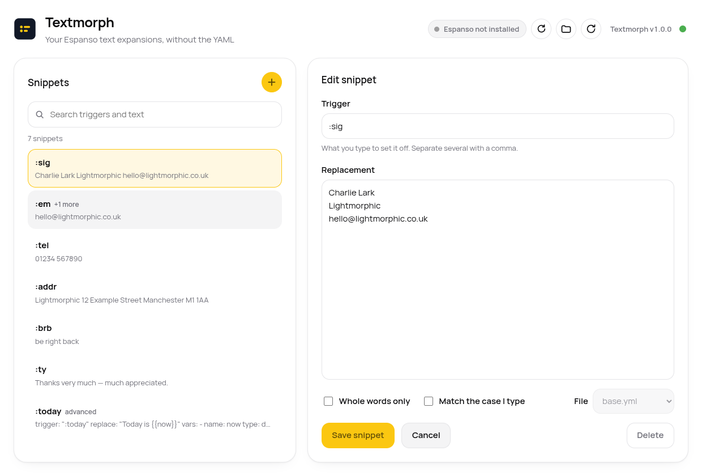

# Lightmorphic Text

A graphical front end for [Espanso](https://espanso.org), the text expander.
Browse, search, add and edit your expansions without ever opening a YAML file.

Linux only, shipped as a single AppImage.



## What it does

- **Every snippet in one searchable list.** Search matches triggers and
  replacement text as you type.
- **A form, not a text editor.** Trigger, replacement, whole-words-only and
  case matching. That's the whole thing.
- **Your files stay yours.** Comments, key order, blank lines and quoting are
  preserved; only the values you actually changed get rewritten. Every save
  keeps a backup first.
- **Snippets it can't safely edit are left alone.** Anything using variables,
  forms, scripts or regular expressions is listed and shown exactly as it
  appears in the file, marked read-only, and never quietly rewritten.
- **Espanso reloads after every save**, so a new snippet works the moment you
  finish typing it.
- **Guided first run.** If Espanso isn't installed, Lightmorphic Text installs it. On
  Wayland it walks you through the one permission step that needs you.
- Light and dark, following your desktop.

## Installing

Download the AppImage from the
[latest release](https://github.com/lightmorphic/text/releases/latest),
make it executable, and run it:

```bash
chmod +x Lightmorphic Text-*.AppImage && ./Lightmorphic Text-*.AppImage
```

Lightmorphic Text keeps itself up to date: the dot beside the version number in the
top right turns amber when a new release is out, and clicking it downloads and
installs it.

### Supported systems

Tested against Linux Mint, Ubuntu, Fedora Silverblue and Bazzite, under both
X11 and Wayland. Nothing is installed system-wide and no package manager is
involved, so an immutable system is treated no differently from any other.

## How Espanso gets installed

If Espanso isn't already on the system, Lightmorphic Text fetches it from Espanso's own
GitHub releases and puts it under `~/.local/share/lightmorphic-text/espanso`. No
password, no `apt`, no `rpm-ostree`, nothing written outside your home folder.

Two things about this are worth knowing, because the obvious approach doesn't
work:

- **The AppImage is unpacked, never run as an AppImage.** Espanso ships its X11
  build as an AppImage, and `--appimage-extract` is handled by the AppImage's
  own embedded runtime with no FUSE involved. That sidesteps the "AppImages
  require FUSE to run" failure on distributions that ship FUSE3 only.
- **The Wayland build borrows the libraries it's missing.** Espanso publishes
  its Wayland build as a `.deb` whose binary expects wxWidgets 3.2 from the
  distribution — which doesn't exist on Fedora Silverblue or Bazzite. Lightmorphic Text
  takes the binary out of the `.deb` and, using `ldd`, copies across only the
  libraries this particular system is actually missing, out of the X11
  AppImage's bundle. Anything the system already provides is left alone, so a
  bundled library can never shadow a newer system one.

A wrapper is written to `~/.local/bin/espanso` so `espanso` works in a terminal
too, and a systemd user service is registered at
`~/.config/systemd/user/espanso.service`.

## Wayland

On Wayland no application can watch what you type through the display server.
Espanso instead reads the keyboard device directly, and that needs your user
account to be in the `input` group. Lightmorphic Text asks for this through your
desktop's own password prompt, then tells you to log out and back in — Linux
only applies a new group at the next login.

If your system has no graphical password prompt, Lightmorphic Text shows you the
command to run instead, with a button to copy it.

## Where things live

| | |
|---|---|
| Espanso config | `~/.config/espanso` |
| Match files | `~/.config/espanso/match/*.yml` |
| Backups of every edit | `~/.local/share/lightmorphic-text/backups` |
| Managed Espanso | `~/.local/share/lightmorphic-text/espanso` |
| Service unit | `~/.config/systemd/user/espanso.service` |

## Building from source

```bash
npm install
npm start          # run it
npm test           # unit tests
npm run build      # produce dist/Lightmorphic Text-<version>-x86_64.AppImage
```

`node scripts/screenshots.js` drives the real app against a throwaway config
and regenerates `docs/shots/`; it doubles as an end-to-end test.
`npx electron scripts/make-icon.js` regenerates the icon PNGs from
`assets/icon.svg`.

## Releasing

Bump `version` in `package.json`, add the matching section to `CHANGELOG.md`,
and push to `main`. The release workflow builds the AppImage, publishes a
GitHub Release with it and the update manifest attached, and running copies of
the app offer the update themselves. Pushing again without a version bump does
nothing.

## Licence

GPL-3.0-or-later. Espanso itself is a separate project with its own licence.
